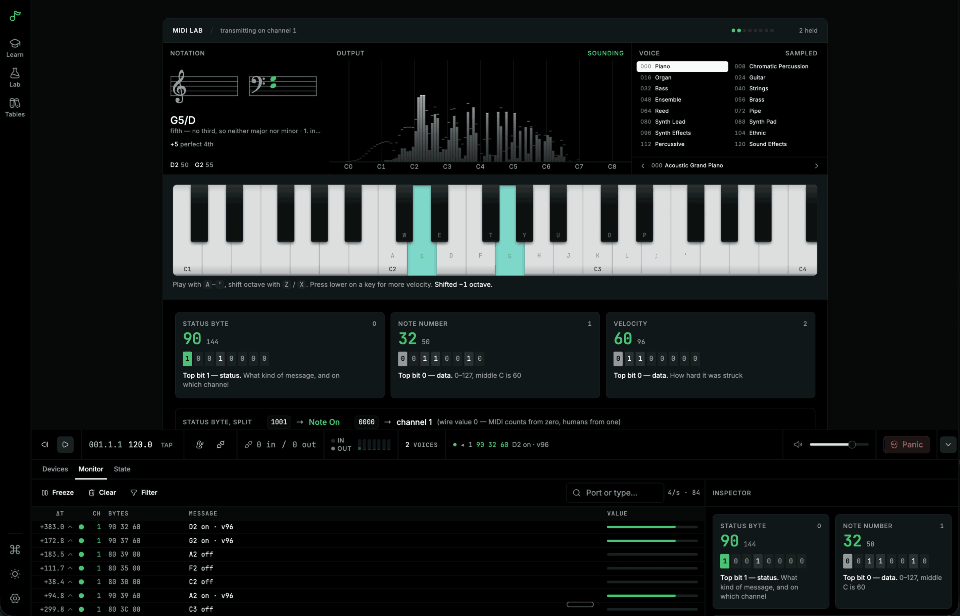

<div align="center">

# MIDI Lab

**Learn MIDI by making it happen.**

[**Open the live app →**](https://neovand.github.io/midilab/)

[](https://neovand.github.io/midilab/)
[](https://github.com/NeoVand/midilab/actions/workflows/deploy.yml)




</div>

---

An interactive course and toolkit that takes you from "MIDI is the thing that
makes those cheap piano sounds" to running a multi-instrument rig from one
clock — or from your own code.

Thirty-one lessons across six acts, wired to a live MIDI engine. Nothing here is
a diagram: press a key and the actual bytes appear, decoded, in the same panel.
Lessons end in **checkpoints** the engine verifies by watching the MIDI stream,
so you advance by making MIDI happen rather than by clicking Next.

Everything works with no hardware attached — a full sixteen-channel synthesiser
is built in and receives exactly the messages an external instrument would — and
better with hardware plugged in.

> **Browser support.** Web MIDI needs a Chromium browser (Chrome, Edge, Brave,
> Arc) or Firefox, on desktop or Android. **Safari ships no Web MIDI at all**, on
> macOS or iOS; everything except hardware access still works there.

## Tech stack

<table>
<tr><td><b>App</b></td><td>


</td></tr>
<tr><td><b>Interface</b></td><td>


</td></tr>
<tr><td><b>Sound&nbsp;&&nbsp;score</b></td><td>


</td></tr>
<tr><td><b>Quality</b></td><td>


</td></tr>
</table>

The protocol layer is written here rather than pulled from a package — the MIDI
parser, the Standard MIDI File codec, the pattern language, the synthesiser and
the lookahead scheduler — because reading them is part of the point. The things
that are somebody else's craft are not: notation is engraved by **VexFlow**, the
spectrum is **audioMotion-analyzer** running on the real output bus, and the
sampled General MIDI instruments come from **smplr**.

## What is in it

### The course — `/learn`

|     | Act                       | Covers                                                                                                                   |
| --- | ------------------------- | ------------------------------------------------------------------------------------------------------------------------ |
| I   | What MIDI actually is     | Control not sound, note numbers, velocity, the status/data bit, Note On and Off, and the envelope in between             |
| II  | The message language      | Channels, Control Change, pitch bend, aftertouch, programs and banks, RPN/NRPN, Channel Mode and panic, System Exclusive |
| III | Time                      | MIDI Clock, resolution and swing, MTC and Link, latency and jitter, Standard MIDI Files                                  |
| IV  | The physical world        | DIN, TRS Type A/B, USB host and device, In/Out/Thru, studio routing, troubleshooting                                     |
| V   | Expression and the future | MPE, MIDI 2.0 and the Universal MIDI Packet                                                                              |
| VI  | Programming MIDI          | Web MIDI, Web Audio, building a sequencer, device profiles, algorithmic patterns, and a capstone                         |

### The Lab — `/lab`

The tools the lessons are built from, standing alone.

- **Monitor** — every byte in the order the wire carried it, the shape of the
  last few seconds, or the standing state of every channel in play
- **Patchbay** — routes between real ports, with channel remapping and splits
- **Programmer** — a step sequencer over the pattern language
- **Device Lab** — profiles for your own hardware, with CC Learn
- **Diagnostics** — latency, jitter, and a troubleshooting tree
- **Console** — JavaScript against your actual rig

### Reference — `/reference`

Status bytes, the full CC table, RPN, GM programs and drums, a note/frequency
table, SysEx manufacturer IDs, and a glossary.

## Running it

```sh
npm install
npm run dev
```

```sh
npm run check     # svelte-check
npm run lint      # eslint + prettier
npm run test      # unit tests, then Playwright e2e
npm run build     # static output in build/
```

## Architecture

A SvelteKit single-page application, statically built. No server, no backend, no
analytics, no network calls except fetching an instrument's samples the first
time you ask for one. Progress lives in the browser's local storage.

```
src/lib/
  midi/        the protocol: parsing, encoding, clock, routing, files, profiles
  audio/       the built-in synthesiser and the sampled General MIDI engine
  patterns/    the mini-notation language and Euclidean rhythms
  sandbox/     the API exposed to code you write in the Console
  components/  the widget kit and lesson chrome
  curriculum/  lesson metadata, progress, and the lessons themselves
  nav.ts       internal links, so they survive being served under a base path
```

`PLAN.md` describes the design decisions in more detail.

## Deploying

Every push to `main` runs [the deploy workflow](.github/workflows/deploy.yml):
types, lint, unit tests and end-to-end tests, then a build with the base path a
GitHub Pages project site needs, then publish. Because the app is a single-page
application with nothing prerendered, the workflow copies `index.html` to
`404.html` — that is what Pages serves for a path that does not exist, so a deep
link or a refresh boots the router instead of showing an error.
