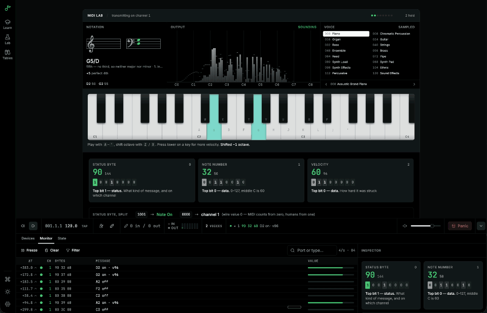

<div align="center">

# MIDI Lab

**Learn MIDI by making it happen.**

[**Open the live app →**](https://neovand.github.io/midilab/)

[](https://neovand.github.io/midilab/)
[](https://github.com/NeoVand/midilab/actions/workflows/deploy.yml)




</div>

---

An interactive course and toolkit that takes you from "MIDI is the thing that
makes those cheap piano sounds" to running a multi-instrument rig from one
clock — or from your own code.

Forty-four lessons across eight acts, wired to a live MIDI engine. Act 0 teaches
music basics; Act I begins MIDI. Press a key and the actual bytes appear, decoded, in the same
panel. Lessons end in **checkpoints** the engine verifies by watching the MIDI
stream. Demonstrations stay separate from learner performances, and manual
self-checks are labelled separately from verified checkpoints. Partial progress
survives navigation and reloads.

It assumes nothing. A programmer who has never counted a bar and a producer who
has never seen a hex byte are each missing half of this subject, and the course
supplies both halves: unfamiliar words carry their definition inline, and every
lesson ends with the primary sources it was compressed from.

Everything works with no hardware attached — a full sixteen-channel synthesiser
is built in and receives exactly the messages an external instrument would — and
better with hardware plugged in. Every keyboard has instrument and channel
controls; drum pads have visible computer-key shortcuts and selectable sampled
kits. One instrument owns computer keys at a time, and typing in a form leaves
the instruments quiet.

> **Browser support.** Web MIDI needs a Chromium browser (Chrome, Edge, Brave,
> Arc) or Firefox, on desktop or Android. **Safari ships no Web MIDI at all**, on
> macOS or iOS; everything except hardware access still works there.

## Tech stack

<table>
<tr><td><b>App</b></td><td>


</td></tr>
<tr><td><b>Interface</b></td><td>


</td></tr>
<tr><td><b>Sound&nbsp;&&nbsp;score</b></td><td>


</td></tr>
<tr><td><b>Quality</b></td><td>


</td></tr>
</table>

The protocol layer is written here rather than pulled from a package — the MIDI
parser, the Standard MIDI File codec, the pattern language, the synthesiser and
the lookahead scheduler — because reading them is part of the point. The things
that are somebody else's craft are not: notation is engraved by **VexFlow**, the
spectrum is **audioMotion-analyzer** running on the real output bus, and the
sampled General MIDI instruments come from **smplr**.

## What is in it

### The course — `/learn`

|     | Act                       | Covers                                                                                                                   |
| --- | ------------------------- | ------------------------------------------------------------------------------------------------------------------------ |
| 0   | Music basics              | Pulse, rhythm, rests, melody, scales, chords, bass, drums, expression, and a first eight-bar composition                 |
| I   | What MIDI actually is     | Control not sound, note numbers, velocity, bytes, Note On and Off, envelopes, synthesis, and MIDI history                |
| II  | The message language      | Channels, Control Change, pitch bend, aftertouch, programs and banks, RPN/NRPN, Channel Mode and panic, System Exclusive |
| III | Time                      | MIDI Clock, resolution and swing, MTC and Link, latency and jitter, Standard MIDI Files                                  |
| IV  | Making music with it      | The piano roll and what it hides, programming drums, and what MIDI cannot write down                                     |
| V   | The physical world        | DIN, TRS Type A/B, USB host and device, In/Out/Thru, studio routing, troubleshooting                                     |
| VI  | Expression and the future | MPE, tuning and microtonality, MIDI 2.0 and the Universal MIDI Packet                                                    |
| VII | Programming MIDI          | Web MIDI, Web Audio, building a sequencer, device profiles, algorithmic patterns, and a capstone                         |

### The Lab — `/lab`

The tools the lessons are built from, standing alone.

- **First Track Studio** — an eight-bar workspace with drums, bass, chords and
  melody. Hear three original studies (**Pocket Soul**, **Night Drive** and
  **Sunlit Pop**), or begin with empty parts. Record with a count-in, layer or
  replace takes, edit pitch, start, duration and velocity, compare mute and solo,
  tighten timing without losing all the feel, and undo an experiment. Named
  projects and the current draft save locally; MIDI export preserves tempo,
  channels and instrument programs, and JSON backups can restore a project.
- **Monitor** — every byte in the order the wire carried it, the shape of the
  last few seconds, or the standing state of every channel in play
- **Patchbay** — routes between real ports, with channel remapping and splits
- **Programmer** — a step sequencer over the pattern language
- **Device Lab** — profiles for your own hardware, with CC Learn
- **Diagnostics** — latency, jitter, and a troubleshooting tree
- **Console** — JavaScript against your actual rig
- **Jukebox** — thirteen public-domain melodies through any instrument you like,
  transposed, re-tempoed, or played against themselves as a round

The six music-foundation lessons include ten listen-and-play drills with an
audio-clock count-in and feedback on pitch, timing, missing and extra notes.
Dynamics drills also assess velocity; phrasing drills assess physical key lengths
so a held note cannot pass as a rest. Slower retries and input-delay adjustment
make practice usable with an on-screen instrument or a MIDI controller. Each
lesson leads into a concrete musical experiment in the Studio.

Music basics also include a playable **circle of fifths** with every chord in a
key, relative and parallel minor, and two cadence endings. A rotatable **3D
roughness landscape** lets you hear three tones, inspect their partials, and
compare harmonic and stretched spectra. The graph and sound share the same
spectrum and a fixed comparison scale. Original A/B phrase studies make timing,
touch, note length, repetition, variation and musical arrival audible and visible.
The lessons connect these experiments to voice leading, register and intention.

The landscape is an independent implementation inspired by
[Aatish Bhatia’s Dissonance explorer](https://aatishb.com/dissonance/) and
[MinutePhysics’s The Physics of Dissonance](https://www.youtube.com/watch?v=tCsl6ZcY9ag),
using [William Sethares’s published roughness kernel](https://sethares.engr.wisc.edu/comprog.html)
with Bhatia’s simplified loudness weighting and three-tone aggregation. Its dense
surface uses linear frequency-ratio axes, projected contours and a fixed height
scale across timbres and registers; the canvas follows the app’s theme.
Sensory roughness describes one acoustic ingredient, not a score for musical quality.

### Reference — `/reference`

Status bytes, the full CC table, RPN, GM programs and drums, a note/frequency
table, SysEx manufacturer IDs, a glossary of roughly a hundred terms filterable
by whether you are missing the protocol half or the music half, and a
bibliography of every source the course was written from.

## Running it

```sh
npm install
npm run dev
```

```sh
npm run check     # svelte-check
npm run lint      # eslint + prettier
npm run test      # unit tests, then Playwright e2e
npm run build     # static output in build/
```

## Architecture

A SvelteKit single-page application, statically built. No server, no backend, no
analytics, no network calls except fetching an instrument's samples the first
time you ask for one. Progress and Studio projects live in the browser's local
storage. Sampled kits use selected hits from LM-2, TR-808 and Casio RZ-1 through
smplr; the synthesiser supplies drums while samples load or if they are unavailable.

```
src/lib/
  midi/        the protocol: parsing, encoding, clock, routing, files, profiles
  audio/       the built-in synthesiser and the sampled General MIDI engine
  patterns/    the mini-notation language and Euclidean rhythms
  sandbox/     the API exposed to code you write in the Console
  music/       notation, harmony, roughness modelling, the melody library and practice
  studio/      original studies, recording, project validation, editing and MIDI export
  components/  the widget kit and lesson chrome
  curriculum/  lesson metadata, progress, the glossary, the bibliography, and the lessons
  nav.ts       internal links, so they survive being served under a base path
```

`PLAN.md` describes the design decisions in more detail.

## Deploying

Every push to `main` runs [the deploy workflow](.github/workflows/deploy.yml):
types, lint, unit tests and end-to-end tests, then a build with the base path a
GitHub Pages project site needs, then publish. Because the app is a single-page
application with nothing prerendered, the workflow copies `index.html` to
`404.html` — that is what Pages serves for a path that does not exist, so a deep
link or a refresh boots the router instead of showing an error.
