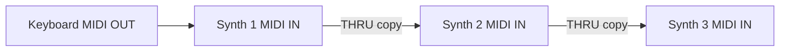
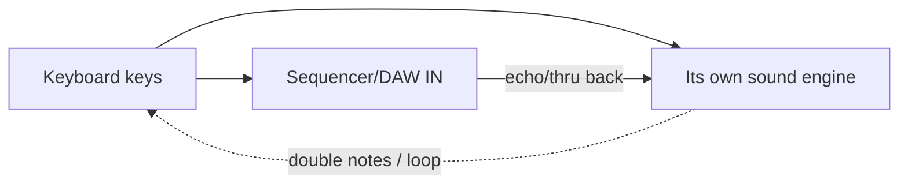
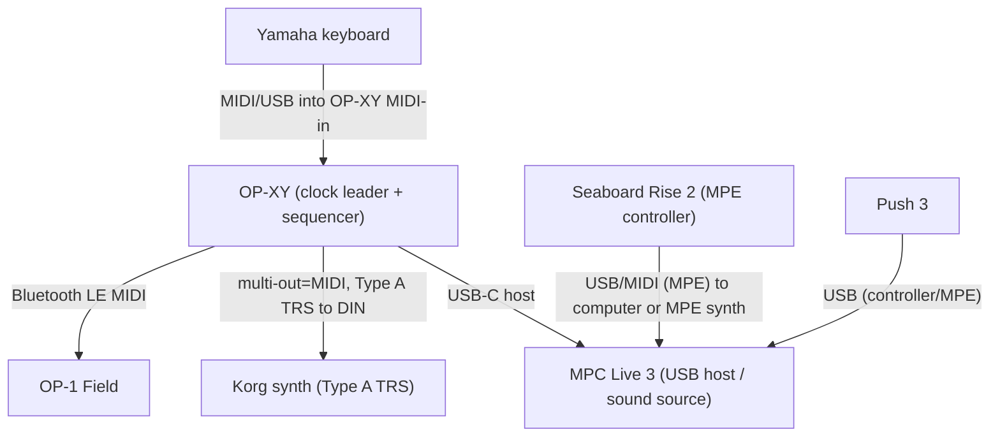
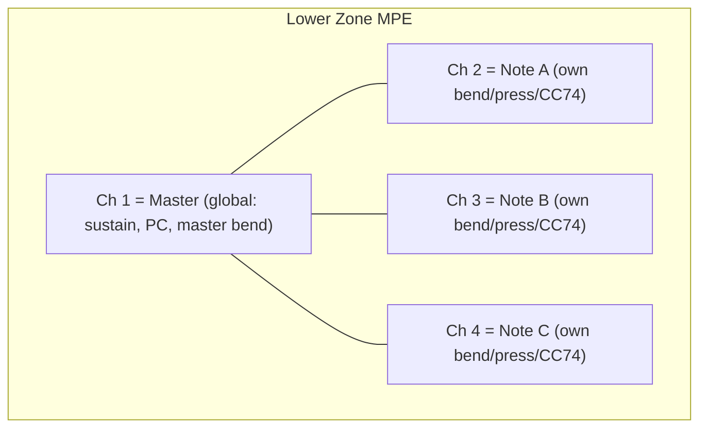

# MIDI From Zero to Mastery: A Complete Tutorial and Studio Reference for Eleo

## TL;DR

- **MIDI is a lightweight digital control language, not audio**: it sends small messages (mostly 1–3 bytes) like "note 60 on, velocity 100" over a 31.25 kbps serial link, and this same 1983 protocol still ties together every device you own — your OP-XY, MPC Live 3, OP-1 Field, Yamaha, Korg, Push 3, and Seaboard.
- **Master five layers and you can "milk" any groovebox**: (1) transport/cabling (5-pin DIN, TRS Type A/B, USB host/device, Bluetooth), (2) channel-voice messages (Note On/Off, CC, Program Change, pitch bend, aftertouch), (3) the CC/RPN/NRPN system for deep parameter control, (4) clock/sync, and (5) SysEx. MPE and MIDI 2.0 are extensions layered on top.
- **For your build goals**: the Web MIDI API (Chromium/Firefox only — not Safari) plus the Web Audio "lookahead scheduler" and Strudel give you everything to build a browser MIDI tool; MCP servers wrapping these are an emerging pattern for AI control.

## Key Findings

1. **MIDI carries performance instructions, never sound.** A Note On message is roughly the size of three text characters. The receiving instrument makes the sound. This is why MIDI is tiny, fast, and still universal 43 years after its 1983 debut.

2. **The whole protocol is built on one bit.** Every byte's top bit flags it as either a _status byte_ (top bit 1, value 128–255) that says "here comes this kind of message" or a _data byte_ (top bit 0, value 0–127) that carries a value. That single design choice is why **0–127 (128 values) appears everywhere** in MIDI.

3. **Your gear splits cleanly into "brains" and "voices."** The OP-XY and MPC Live 3 are the natural sequencer/hubs (both are USB MIDI hosts, both send clock, both do per-track channel routing). The Seaboard Rise 2 and Push 3 are expressive controllers. The Yamaha, Korg, and OP-1 Field are best treated as sound sources. The OP-1 Field is deliberately MIDI-limited.

4. **TRS MIDI type matters for your exact gear.** Korg and Teenage Engineering use **Type A**; Arturia/Novation/1010music use **Type B**. Using the wrong adapter simply does not work (it isn't dangerous, it's just silent). Buy Type A adapters for the OP-XY↔Korg path.

5. **MPE is "one channel per note."** The Seaboard Rise 2's five dimensions of touch work by giving every finger its own MIDI channel so pitch bend and CC74 can be per-note. Push 3 both sends and (standalone) responds to MPE.

6. **MIDI 2.0 is real but early in 2026.** It is backward compatible, adds 32-bit resolution, bidirectional negotiation (MIDI-CI), and per-note controllers, but for a hardware studio like yours it is not yet a daily-driver concern — MIDI 1.0 remains what actually connects your devices.

## Details

### PART 1 — MIDI FUNDAMENTALS (the core tutorial)

#### 1.1 What MIDI is, and what it is not

**MIDI** stands for **Musical Instrument Digital Interface**. The single most important idea in this entire document: **MIDI is not audio.** It carries no sound whatsoever. Instead it carries _events_ and _control instructions_ — the digital equivalent of a player-piano roll. A MIDI message says things like "press this key this hard," "let go of that key," "turn this knob to 40," "change to sound #12," or "advance the beat." The instrument that _receives_ those messages is what actually produces sound.

An analogy: MIDI is like a screenplay (stage directions: "actor enters, speaks loudly"), while audio is the finished film (the actual recorded performance). You can email a screenplay in a tiny file; the film is gigabytes. This is why a 3-minute MIDI file can be a few kilobytes while the rendered audio is tens of megabytes.

**Consequences of this event-vs-audio distinction — memorize these:**

- You can change the sound _after_ recording: the same MIDI performance can drive a piano today and a synth bass tomorrow.
- You can edit every note, its timing, and its velocity after the fact without "re-recording."
- MIDI needs almost no bandwidth (31,250 bits per second — see §1.3).
- **A MIDI cable between two devices carries no audio.** You still need audio cables to hear anything. This trips up every beginner.

**A tiny bit of music theory, defined as we need it:**

- A **note** is a pitch (e.g., "middle C").
- An **octave** is the distance between a note and the next note of the same name; it's a doubling of frequency. Notes are named A–G and repeat every octave.
- A **semitone** (or half-step) is the smallest step on a piano keyboard — one key to the very next key (including black keys). There are 12 semitones in an octave.
- **Velocity** is how hard/fast you strike a key, which usually maps to loudness and often brightness. It is not the same as volume (volume is a separate control).
- **Tempo** is speed, measured in **BPM** (beats per minute). 120 BPM = two beats per second.

#### 1.2 A brief history, and why MIDI survived

Before MIDI, synths from different companies could not talk to each other. In October 1981, **Dave Smith** (founder of Sequential Circuits, designer of the Prophet-5) and colleague Chet Wood presented a paper at the Audio Engineering Society proposing a "Universal Synthesizer Interface." Smith worked with **Ikutaro Kakehashi** of Roland (and Tom Oberheim), and Japanese and American manufacturers cooperated to refine the idea into MIDI. Smith suggested the name "MIDI."

MIDI was publicly demonstrated at the January 1983 NAMM show, where a **Sequential Circuits Prophet-600** was connected by a 5-pin cable to a **Roland Jupiter-6** — two rival companies' instruments playing each other. The **Prophet-600** (shipping December 1982) is generally called the first MIDI synthesizer. In 1983 only five companies were working on MIDI: Sequential Circuits, Kawai, Korg, Roland, and Yamaha. Smith and Kakehashi received a Technical Grammy in 2013 for it. Dave Smith died in 2022.

MIDI succeeded precisely because it was a cooperative, cross-manufacturer standard rather than a proprietary format war. The standard is maintained today by the **MIDI Manufacturers Association (MMA)** / **The MIDI Association (TMA)** in the US and **AMEI** in Japan. The core **MIDI 1.0 Detailed Specification** dates in its stable form to version 4.2 (1996).

Why is it still ubiquitous? Because it is simple, cheap to implement, "good enough" for note/control data, and — crucially — _backward compatible_. A 1983 synth and a 2026 groovebox speak the same core language.

#### 1.3 The transport/physical layer: how the bytes actually travel

MIDI 1.0 is, at its heart, a **serial data stream at 31,250 bits per second** (31.25 kbps, often called 31.25 kBaud), asynchronous, with 1 start bit, 8 data bits, and 1 stop bit — so 10 bits per byte, giving a maximum of **3,125 bytes per second**. It is a **one-way** connection: data flows from a device's **MIDI OUT** to another device's **MIDI IN**. To get two-way communication you need two cables.

**The connectors and transports you will actually encounter:**

**(a) 5-pin DIN.** The classic round MIDI connector. Only 3 of the 5 pins are traditionally used (pin 2 = shield/ground, pins 4 and 5 = the current-loop data pair). It is electrically a _current loop_ with an opto-isolator on the input, which is why MIDI is robust against ground loops and interference.

**(b) TRS MIDI (3.5mm minijack).** As gear shrank, manufacturers replaced the bulky DIN with a 3.5mm tip-ring-sleeve (TRS) "minijack." The MMA later standardized this, but two incompatible wirings existed first and both remain common:

- **Type A** (the eventual standard): used by **Korg, Teenage Engineering, Akai, Line 6, Make Noise**.
- **Type B**: used by **Arturia, Novation, 1010music, Polyend**.
- The two types simply swap which conductor (tip vs ring) carries the data-source vs data-sink signal. **Using the wrong type means no data flows** — it will not damage anything, it just silently fails.
- **For your studio this is critical**: your OP-XY multi-out is **Type A**, and Korg gear is **Type A** (Korg's own support explicitly warns that Type B adapters "will not work correctly" with Korg devices), so a straight Type A TRS↔DIN adapter connects them. Keep a couple of Type A adapters on hand. A switchable adapter (e.g., Retrokits RK-TRS-X) covers both if you add Type B gear later.

**(c) USB-MIDI.** Most modern gear also does MIDI over USB. Two crucial roles:

- **USB Device** (a.k.a. "peripheral"): the gear must be plugged into a computer or a USB _host_ to work. A plain MIDI keyboard is usually device-only.
- **USB Host**: the device can _supply_ the connection and talk to other USB-MIDI gear _without a computer_. Your **OP-XY**, **MPC Live 3**, and **OP-1 Field** can all act as USB MIDI hosts — this is what lets them drive other USB gear directly.
- **Class-compliant** means the device needs no special driver — the OS's built-in USB-MIDI driver handles it. Nearly all modern MIDI gear is class-compliant.

**(d) Bluetooth LE MIDI.** Wireless MIDI over Bluetooth Low Energy. Your OP-XY and OP-1 Field support it. Convenient, slightly higher latency than wired; fine for notes/clock in many cases, less ideal for tight live timing.

**(e) MIDI over network (RTP-MIDI / "AppleMIDI").** MIDI carried over Ethernet/Wi-Fi using the RTP-MIDI standard; built into macOS ("Network MIDI") and available on Windows/Linux. Useful for computer-to-computer and some pro devices; not central to your current gear.

**MIDI THRU, daisy-chaining, and hubs:**

- **MIDI THRU** is a port that outputs an _exact copy_ of what arrived at MIDI IN (not what the device itself generates). It lets you **daisy-chain**: Device A OUT → Device B IN, Device B THRU → Device C IN, and so on.
- Daisy chains have limits: each THRU hop adds a tiny delay and can degrade the signal, so chains longer than ~3 devices can get unreliable.
- A **MIDI THRU box / hub** solves this by splitting one OUT to many INs in parallel. A **MIDI merger** combines multiple OUTs into one IN. A **MIDI router/interface** (or a computer/DAW, or your MPC) does both intelligently.



#### 1.4 The message structure: status bytes, data bytes, and why 0–127 is everywhere

This is the beating heart of MIDI. Read this section twice.

Every MIDI message is a sequence of 8-bit **bytes**. There are exactly two kinds:

- **Status byte**: the **most significant bit (MSB) is 1**, so its value is **128–255** (hex 0x80–0xFF). It announces _what kind_ of message is coming and (for channel messages) on which channel.
- **Data byte**: the **MSB is 0**, so its value is **0–127** (hex 0x00–0x7F). It carries an actual value.

Because a data byte only has 7 usable bits, it can express exactly **2⁷ = 128 values, numbered 0–127.** _This is the origin of the number that haunts all of MIDI_: 128 notes, 128 velocities, 128 controllers, 128 CC values, 128 programs. Whenever you see 0–127 or "128 of something," it's because it fits in one data byte.

A status byte for a **channel message** packs two things into its 8 bits:

- The **high 4 bits (upper nibble)** = the message type (e.g., 1001 = Note On).
- The **low 4 bits (lower nibble)** = the MIDI channel, 0–15 (which humans call channels 1–16).

**Worked example — pressing middle C on channel 1:**
When you press middle C moderately hard on channel 1, the device sends three bytes:

```
0x90  0x3C  0x64
```

- `0x90` = status byte. Upper nibble `9` = Note On; lower nibble `0` = channel 1 (channels are zero-indexed internally).
- `0x3C` = 60 decimal = note number for middle C.
- `0x64` = 100 decimal = velocity (moderately hard).

When you release the key, it sends either a Note Off (`0x80 0x3C 0x00`) **or** — very commonly — a Note On with velocity 0 (`0x90 0x3C 0x00`), which counts as "off." (The velocity-0 trick exists to enable _running status_, next.)

**Running status:** If several consecutive messages share the same status byte, the status byte may be _omitted_ on the later ones to save bandwidth. So a stream of notes all on channel 1 might send `0x90` once, then just pairs of data bytes. This is why "Note On velocity 0" is used for note-off: it lets a whole passage of notes reuse a single `0x90` status byte. You'll see running status in MIDI files and on the wire; any parser you write must handle it (remember the last status byte and reapply it when a data byte appears where a status byte was expected).

**Two big categories of messages:**

1. **Channel messages** (status 0x80–0xEF): addressed to one of the 16 channels. Split into _Channel Voice_ (notes, CC, pitch bend, etc.) and _Channel Mode_ (special CCs 120–127).
2. **System messages** (status 0xF0–0xFF): not tied to a channel; heard by all devices. Split into _System Exclusive_ (0xF0), _System Common_ (0xF1–0xF6), and _System Real-Time_ (0xF8–0xFF).

**Reference table — the channel voice status bytes** (`n` = channel nibble 0–F):

| Message               | Status | Data byte 1  | Data byte 2        | # bytes |
| --------------------- | ------ | ------------ | ------------------ | ------- |
| Note Off              | 0x8n   | note number  | release velocity   | 3       |
| Note On               | 0x9n   | note number  | velocity (0 = off) | 3       |
| Polyphonic Aftertouch | 0xAn   | note number  | pressure           | 3       |
| Control Change (CC)   | 0xBn   | controller # | value              | 3       |
| Program Change        | 0xCn   | program #    | —                  | 2       |
| Channel Aftertouch    | 0xDn   | pressure     | —                  | 2       |
| Pitch Bend            | 0xEn   | LSB (fine)   | MSB (coarse)       | 3       |

#### 1.5 MIDI channels (1–16)

A single MIDI cable carries **16 independent channels**. Think of them like TV channels on one cable: every device "hears" all of them but pays attention only to the channel(s) it's set to. This was built in so one cable could control several instruments, each on its own channel.

- A **monotimbral** instrument plays one sound and typically listens on one channel (its "basic channel").
- A **multitimbral** instrument can play several different sounds at once, each assigned to a different channel — e.g., piano on ch 1, bass on ch 2, drums on ch 10. Your Yamaha and Korg synths, the OP-XY, and the MPC's plugin/MIDI setups are multitimbral in this sense. (Historic trivia: Yamaha's TX816 was literally eight DX7 modules chained to be played this way, one per channel.)

**Channel-per-track workflow (the groovebox pattern you'll live in):** On a groovebox/sequencer, each _track_ usually transmits on its own MIDI channel. Track 1 → channel 1 → drives your Korg; Track 2 → channel 2 → drives your Yamaha; and so on. The OP-XY makes MIDI channel **selectable per track**; the MPC assigns a MIDI channel per MIDI track. This is the foundation of using one device as the "brain" of your whole studio (see Part 2).

#### 1.6 Note On / Note Off, velocity, and note numbering

- **Note number** is a data byte 0–127. **Middle C = 60.** Each increment of 1 is one semitone. So 61 = C#, 62 = D, etc. 12 semitones = one octave, so adding 12 to a note number raises it exactly one octave (60 → 72 = the C one octave up).
- The full range 0–127 spans about 10.5 octaves (note 0 ≈ C-1, note 127 = G9).
- **Velocity** (0–127) is how hard the note is struck. In a Note On, velocity 0 means "note off." Velocity 1 is the softest audible strike, 127 the hardest.
- **Release velocity** (in a true Note Off) is how fast you _released_ the key — rarely used.

**The C3 vs C4 headache (important and real):** MIDI note 60 is fixed and unambiguous — it is always middle C. But manufacturers _disagree on what to call it_. Yamaha and many others label middle C as **C3**; Roland, Ableton, and others label it **C4**; the "scientific pitch notation" convention also uses C4. So the same MIDI note 60 might read as "C3" on your Yamaha and "C4" in Ableton. **The note number never changes — only the octave label does.** When a drum map says "C1 = kick," check whether that document uses the C3 or C4 convention, because their "C1" might be your gear's "C2." Rule of thumb: trust the note _number_ (60), not the octave _name_.

#### 1.7 Control Change (CC) messages in depth

**Control Change** (status 0xBn) is the workhorse for real-time parameter control — the "milking MIDI" section. Format: `0xBn, controller#, value`, where both controller number and value are data bytes 0–127.

There are 128 controller numbers. Some are **defined by the standard**, many are **undefined and free** for manufacturers/you to assign. Switch-type CCs treat 0–63 as "off" and 64–127 as "on."

**Key defined CCs (memorize the starred ones):**

| CC#     | Name                                            | Notes                                                   |
| ------- | ----------------------------------------------- | ------------------------------------------------------- |
| 0       | Bank Select MSB                                 | with CC32, chooses sound bank (§1.8)                    |
| 1★      | Modulation wheel                                | the classic "mod wheel," usually vibrato/movement       |
| 2       | Breath controller                               |                                                         |
| 4       | Foot controller                                 |                                                         |
| 5       | Portamento time                                 |                                                         |
| 6       | Data Entry MSB                                  | used by RPN/NRPN (§1.11)                                |
| 7★      | Channel Volume                                  | overall channel volume                                  |
| 8       | Balance                                         |                                                         |
| 10★     | Pan                                             | left/right position                                     |
| 11★     | Expression                                      | _relative_ volume within CC7; use for swells/crescendos |
| 32      | Bank Select LSB                                 | fine half of bank select                                |
| 38      | Data Entry LSB                                  | RPN/NRPN fine value                                     |
| 64★     | Sustain (damper) pedal                          | switch: ≤63 off, ≥64 on                                 |
| 65      | Portamento on/off                               | switch                                                  |
| 71★     | Resonance (filter, "Timbre/Harmonic Intensity") | _convention_, not guaranteed                            |
| 74★     | Filter cutoff ("Brightness")                    | _convention_; also MPE's "slide" dimension              |
| 72/73   | Release / Attack time                           | conventions                                             |
| 91      | Reverb send                                     |                                                         |
| 93      | Chorus send                                     |                                                         |
| 98/99   | NRPN LSB/MSB                                    | §1.11                                                   |
| 100/101 | RPN LSB/MSB                                     | §1.11                                                   |
| 120–127 | Channel Mode messages                           | see below                                               |

**Channel Mode messages (CC 120–127)** are special "system-ish" CCs:

- **120** = All Sound Off
- **121** = Reset All Controllers
- **122** = Local Control on/off (huge for feedback loops — §1.14)
- **123** = All Notes Off (your rescue for stuck notes)
- **124–127** = Omni Off/On, Mono/Poly mode

**"Convention, not guarantee" warning:** CC1 (mod), CC7 (volume), CC10 (pan), CC11 (expression), and CC64 (sustain) are near-universal. But CC74 = cutoff and CC71 = resonance are only _conventions_ — many synths use different CCs, or none, and require you to map them. Always consult the device's **MIDI implementation chart** (§1.13).

**14-bit (high-resolution) CCs:** 128 steps can sound "steppy" on slow filter sweeps or volume fades. To get finer resolution, CCs **0–31 (MSB, coarse)** can be paired with CCs **32–63 (LSB, fine)**: the LSB is always the MSB's number + 32. Together they form a **14-bit value = 0–16,383** (MSB × 128 + LSB). Example: CC1 (mod MSB) pairs with CC33 (mod LSB). In practice, **many instruments ignore the LSB** and use only the 7-bit MSB, so test before relying on it.

**CC mapping / "MIDI learn":** Almost all modern gear and software supports **MIDI learn**: you enter learn mode, click a parameter on screen (or select a knob), then wiggle a physical knob; the device records which CC that knob sends and binds it. This is how you assign your Push 3 or Seaboard knobs to filter cutoff on a soft-synth, or map the MPC's Q-Link knobs to a hardware synth's parameters. Workflow to remember: **pick the parameter → arm learn → move the control → done.**

#### 1.8 Program Change and Bank Select

**Program Change (PC)** (status 0xCn, one data byte: program 0–127) tells an instrument "switch to sound/patch number N." It's a 2-byte message. Problem: 128 programs isn't enough for modern synths with thousands of patches.

**Bank Select** solves this. It's not its own message type — it's **CC0 (Bank MSB)** plus **CC32 (Bank LSB)**. A "bank" is a shelf of up to 128 programs. With MSB and LSB you get 128 × 128 = 16,384 banks, each holding 128 programs = **over 2 million addressable patches per channel**.

**The correct order (this is the #1 mistake):** you must send **Bank Select (CC0 then CC32) _before_ the Program Change.** The bank select just "arms" which shelf; the Program Change is what actually recalls the sound. Sequence:

```
CC0  = bank MSB
CC32 = bank LSB
PC   = program number
```

**Worked example** — recall program 5 in bank (MSB 0, LSB 2) on channel 1:

```
0xB0 0x00 0x00   (CC0 = 0)
0xB0 0x20 0x02   (CC32 = 2)
0xC0 0x04        (Program Change 5 → value 4, because programs are often numbered from 1 in the UI but 0 on the wire)
```

**Off-by-one nightmare:** manufacturers disagree whether the _first_ program is "0" or "1." Many synths' front panels show patch 1 = wire value 0. So if your OP-XY sends PC to select "program 58" and your synth shows 57, that's this off-by-one (a real, reported OP-XY↔OB-6 behavior). Always test and note the offset for each device.

**Manufacturer bank schemes differ:** Yamaha's **XG** and Roland's **GS** each define their own bank MSB/LSB maps; **General MIDI 2** uses bank MSB 121 with an LSB to pick variations (§1.12). Your Yamaha and Korg will each document their bank layout in the manual — you'll need those tables to recall specific patches remotely.

#### 1.9 Pitch bend and aftertouch

**Pitch Bend** (status 0xEn) is its own message (not a CC) because it needs high resolution — you don't want steppy pitch slides. It uses **two data bytes = 14-bit resolution = 0–16,383**, with **8192 (0x2000) = center (no bend).** Values below 8192 bend down, above bend up. The actual pitch range (±2 semitones by default, up to ±24) is set on the receiving synth, often via an RPN (§1.11).

**Aftertouch (key pressure)** = pressing _harder on a key you're already holding_, for vibrato, swells, filter opening, etc. Two kinds:

- **Channel Aftertouch / Channel Pressure** (status 0xDn, one data byte): a _single_ pressure value for the whole channel — if you press any key harder, all held notes get the same pressure. Cheap to implement; most keyboards with aftertouch use this.
- **Polyphonic Aftertouch / Poly Key Pressure** (status 0xAn, two data bytes: note# + pressure): _per-note_ pressure. Rare and expensive (needs a sensor under every key). Found on MPE controllers (Seaboard), the Push 3 pads, and a few high-end keyboards. Many synths ignore it even when received.

#### 1.10 RPNs and NRPNs

CCs only give you 128 controller "addresses," and most are spoken for. **RPNs and NRPNs are a clever hack to get thousands more parameters** out of the existing CC system, by using a few CCs as a "pointer + value" mechanism.

- **RPN = Registered Parameter Number**: standardized by the MMA (same meaning on every device).
- **NRPN = Non-Registered Parameter Number**: manufacturer-specific (each company defines its own).

**The mechanism (four CCs):**

1. Select _which_ parameter with a pair of CCs:
   - RPN: **CC101 = MSB, CC100 = LSB**
   - NRPN: **CC99 = MSB, CC98 = LSB**
2. Set the value with **CC6 = Data Entry MSB** (and optionally **CC38 = Data Entry LSB** for fine/14-bit).
3. (Best practice) send the **Null RPN** (CC101=127, CC100=127) afterward to "close" the selection so stray Data Entry messages don't accidentally change it.

**Worked example — set pitch bend range to ±12 semitones on channel 1** (Pitch Bend Sensitivity is RPN 0,0):

```
0xB0 0x65 0x00   (CC101 = 0  → RPN MSB)
0xB0 0x64 0x00   (CC100 = 0  → RPN LSB)   → now "Pitch Bend Sensitivity" is selected
0xB0 0x06 0x0C   (CC6   = 12 → 12 semitones)
0xB0 0x26 0x00   (CC38  = 0  → 0 cents, optional)
0xB0 0x65 0x7F   (CC101 = 127 → Null, close)
0xB0 0x64 0x7F   (CC100 = 127)
```

**The standard RPNs** (only a handful exist):

- **RPN 0,0** = Pitch Bend Sensitivity (range)
- **RPN 0,1** = Channel Fine Tuning
- **RPN 0,2** = Channel Coarse Tuning
- **RPN 0,3** = Tuning Program Select
- **RPN 0,4** = Tuning Bank Select
- **RPN 0,6** = **MPE Configuration Message (MCM)** — this is how MPE zones are set up (§Part 3)
- **RPN 127,127** = Null (cancel)

**Why manufacturers use NRPNs:** to expose deep synth parameters (filter, envelope, LFO details) that have no standard CC. Your Korg and Yamaha likely use NRPNs for many parameters — the manual's MIDI implementation chart lists them. (Yamaha's XG spec, for example, defines NRPNs for vibrato rate/depth/delay, filter cutoff/resonance, EG times, and per-drum parameters.) Note: the OP-XY's public MIDI documentation exposes its parameters as _CCs_, not NRPNs — see Part 2.

#### 1.11 System messages: SysEx, System Common, System Real-Time

**System Exclusive (SysEx)** — status **0xF0 … 0xF7** — is the open-ended escape hatch. Structure:

```
0xF0  <manufacturer ID>  <any number of data bytes, each 0–127>  0xF7
```

- The byte(s) after 0xF0 are the **manufacturer ID**, assigned by the MMA (Sequential got ID 1). Because one byte only allows 127 makers, an ID starting with `0x00` is followed by two more bytes (3-byte extended IDs), covering 16,000+ manufacturers. ID **0x7D** is reserved for educational/development use; **0x7E** (non-real-time) and **0x7F** (real-time) are **Universal SysEx** — standardized messages any device can use (e.g., Universal Device Inquiry, GM On/Off, MPE config, MIDI Machine Control).
- Every payload byte must be 7-bit (0x00–0x7F); nothing ≥0x80 may appear until the closing 0xF7.
- **Uses:** whole-patch dumps, bulk "librarian" backups of all your sounds, deep parameter edits not reachable by CC, tuning tables, and **firmware updates**. Editor/librarian software (and the security-sensitive nature of firmware updates) is why Web MIDI treats SysEx as a separate permission (§Part 4).

**System Common messages (0xF1–0xF6):**

- **0xF1** MIDI Time Code Quarter Frame (part of MTC, §1.12)
- **0xF2** Song Position Pointer (SPP) — 14-bit count of "MIDI beats" (1 beat = 6 clocks = a 16th note) since song start; lets devices jump to the same location
- **0xF3** Song Select
- **0xF6** Tune Request (asks analog synths to self-tune)

**System Real-Time messages (0xF8–0xFF)** — single bytes, may appear _anywhere_, even inside other messages, because timing is critical:

- **0xF8** Timing Clock (24 per quarter note — see sync)
- **0xFA** Start
- **0xFB** Continue
- **0xFC** Stop
- **0xFE** Active Sensing (optional "I'm still here" heartbeat)
- **0xFF** System Reset

#### 1.12 Synchronization deep dive (clock, transport, MTC)

This is essential for running your grooveboxes together in time.

**MIDI Clock (a.k.a. MIDI Beat Clock)** is a stream of **Timing Clock bytes (0xF8) sent 24 times per quarter note** — "24 PPQN" (pulses per quarter note). It carries _no absolute time_ — it's purely tempo-relative. The receiver counts pulses to derive the beat and infers tempo from how fast pulses arrive. At 120 BPM, that's 48 clocks per second.

- **Transport control** rides alongside: **Start (0xFA)** begins from the top; **Stop (0xFC)** halts; **Continue (0xFB)** resumes from where Stop left off. **Song Position Pointer** (sent before Start/Continue) lets everyone jump to the same bar/beat.

**Leader/follower (formerly master/slave):** one device is the **clock leader** (generates the clock) and the others are **followers** (set to "external"/"sync to MIDI clock"). Only one leader per network.

- On the **OP-XY**: it can send clock (over its multi-out sync modes, over Bluetooth, over USB) and can receive clock via its MIDI-in — so it works as either leader or follower.
- On the **MPC Live 3**: Menu → Preferences → **MIDI/Sync** → set **Sync Send = MIDI Clock** (to be leader) or **Sync Receive** (to be follower). It also offers **MTC** and **Ableton Link**.

**MIDI Time Code (MTC)** is a _different_ family: it's MIDI's version of **SMPTE timecode** (hours:minutes:seconds:frames — _absolute_ time), used to sync to video/tape rather than musical tempo. It's sent as Quarter-Frame messages (0xF1) plus full-frame SysEx. **Use MIDI Clock for musical/tempo sync (synths, drum machines, arpeggiators); use MTC for absolute-time/video sync.** They are not interchangeable.

**MIDI Machine Control (MMC)** is Universal Real-Time SysEx for transport (play/stop/rewind/record-arm) of recorders.

**Jitter and latency — the practical problem:** because MIDI is serial and clock shares the wire with notes, timing can wobble ("jitter"). Real example: the Akai MPC Live/X have been widely reported to have noticeable clock-sync jitter (users measured up to ~22 ms of drift when following an external clock). Mitigations:

- Choose the device with the **tightest internal clock as the leader** (often a dedicated sequencer over a computer/DAW).
- Minimize daisy-chain hops between leader and followers; use a hub/parallel distribution.
- Keep heavy CC/SysEx traffic off the same wire as clock when timing is critical.
- Prefer DIN/USB over Bluetooth for the clock path when timing matters.
- Where available, use **Ableton Link** (network tempo sync) between Link-capable gear (the MPC supports it) — it's often tighter than MIDI clock.

#### 1.13 Practical routing, Local Control, and feedback loops

**Local Control On/Off (CC122):** On a keyboard-synth, "local control" is the internal wire connecting its own keys to its own sound engine. When you sequence it from a DAW/groovebox, you usually want **Local Control OFF** so the keyboard's keys go _out_ to the sequencer, and only the sequencer's returning MIDI plays the sound engine. Otherwise every note plays _twice_ and you can create a **MIDI feedback loop**:



If the DAW echoes incoming MIDI back out to the same synth _and_ local control is on, notes stack up and pile into a loop. **Fixes:** turn Local Control OFF on the keyboard, and/or disable MIDI "thru/echo" for that port in the DAW. To kill stuck notes, send **All Notes Off (CC123)** or hit the panic button.

**Common routing topologies:**

- **Keyboard → sound module**: simplest; keyboard OUT → module IN, set to same channel.
- **DAW/computer as hub**: everything's OUT→interface→DAW, DAW routes and echoes to destinations; most flexible, needs a computer.
- **Groovebox as brain**: your OP-XY or MPC sequences everything, sends clock, routes channels to each synth — no computer needed (your likely preferred mode).

**MIDI processing** you'll use constantly: **channel filtering/remapping** (change incoming ch 1 to ch 5), **transposition** (add N semitones to note numbers), **velocity curves** (reshape how hard-you-hit maps to velocity), **CC filtering/remapping**, and **note/CC delays**. The MPC, OP-XY "Brain" transposer, and any DAW can do these.

**MIDI vs audio latency:** MIDI messages are tiny and fast on the wire (a 3-byte note ≈ 1 ms to transmit). Perceived latency usually comes from USB buffering, the synth's own note-response time, and (in software) audio buffer size — not from MIDI itself. Keep audio buffers reasonable and prefer direct hardware paths for the tightest feel.

#### 1.14 General MIDI (GM and GM2)

**General MIDI (GM)** was developed by the American MIDI Manufacturers Association (MMA) and the Japan MIDI Standards Committee (JMSC) and first published in 1991. It is an _agreement about what sounds live where_ so a MIDI file plays back with roughly the right instrumentation on any GM device:

- **128 standardized instrument programs**: Program 1 = Acoustic Grand Piano, 25 = Nylon Guitar, 33 = Acoustic Bass, 41 = Violin, etc. (organized in families of 8).
- **Channel 10 is reserved for drums/percussion**: on channel 10, note numbers select _drum sounds_, not pitches. **Note 36 = Bass Drum 1, 38 = Acoustic Snare, 42 = Closed Hi-Hat, 46 = Open Hi-Hat, 49 = Crash Cymbal 1**, and so on (the GM drum map spans notes 35–81).
- Minimum polyphony (24 voices), response to velocity, and certain CCs are required.

**GM2** was adopted in 1999 by the MMA and extends GM: General MIDI 2 synthesizers access all 256 instruments by setting **CC0 (Bank Select MSB) to 121** and using **CC32 (Bank Select LSB)** to select the variation bank before a Program Change, and add more drum kits and required controllers.

**Why hardware synths often ignore GM:** GM was designed for _interchange_ (multimedia, ringtones, karaoke). Serious hardware synths — your Yamaha, Korg, and boutique gear — prioritize their _own_ curated sounds and layouts, so they frequently **aren't GM-compliant** or relegate GM to a special mode. Don't assume "program 1 = piano" on a non-GM synth; check its patch list. (Amusingly, the OP-1 Field doesn't ship a GM bank; third-party GM sample packs exist to add one.)

#### 1.15 Standard MIDI Files (SMF)

A **Standard MIDI File** (`.mid`) is how MIDI performances are saved to disk. Structure = "chunks":

- **Header chunk** (`MThd`): specifies **format**, number of tracks, and **division** (timing resolution).
  - **Format 0**: everything merged into one track.
  - **Format 1**: multiple parallel tracks that play together (the common DAW export).
  - **Format 2**: multiple independent patterns/sequences (rare).
  - **Division / PPQN**: ticks per quarter note (e.g., 96, 480, 960). Higher = finer timing resolution. (Alternatively, a negative value encodes SMPTE-based timing.)
- **Track chunk(s)** (`MTrk`): a stream of events, each preceded by a **delta-time** (ticks since the previous event, stored as a compact "variable-length quantity"). Includes the MIDI messages plus **meta-events** (tempo, time signature, track name, key signature, end-of-track, lyrics). Tempo is stored as microseconds-per-quarter-note (e.g., 500,000 µs = 120 BPM).

**Ticks vs clock:** SMF **PPQN** (file resolution, often 480–960) is separate from the **24-PPQN wire clock** (§1.12). The file stores fine tick positions; playback converts them to real time using the tempo meta-event. Your MPC and DAWs read/write SMFs; hardware sequencers store MIDI internally at their own PPQN (the OP-XY sequences at **1920 PPQN**).

#### 1.16 How to read a MIDI implementation chart (the master key)

Every serious MIDI device ships a **MIDI Implementation Chart** — a standardized grid showing exactly what the device **Transmits** and **Recognizes**. Learning to read it is how you "master any piece of gear." Columns are typically **Function | Transmitted | Recognized | Remarks**, with rows for:

- **Basic Channel** (default and changeable range)
- **Mode** (Omni/Poly/Mono defaults)
- **Note Number** (and which range actually sounds)
- **Velocity** (Note On/Off — does it send/respond?)
- **Aftertouch** (Key/Channel — does it do poly or channel?)
- **Pitch Bend** (yes/no)
- **Control Change** (which CC numbers, with the parameter each controls — _the most useful rows_)
- **Program Change** (range, and bank select support)
- **System Exclusive** (yes/no, and where the SysEx spec is)
- **System Common / Real-Time** (SPP, clock, etc.)
- **Aux** (Local on/off, All Notes Off, Active Sensing, Reset)

**How to use it practically:** an "O" means supported, "X" means not. If your Korg's chart shows "Control Change ... 74 = cutoff (O, O)," you know you can both send and receive cutoff on CC74. If pitch bend shows "X" in Recognized, no amount of sending pitch bend will do anything. **When a knob "doesn't work over MIDI," the chart tells you why in about 15 seconds.**

#### 1.17 MIDI 2.0 and MIDI-CI (status as of 2026)

**MIDI 2.0** is a major, backward-compatible evolution. Core pieces:

- **Universal MIDI Packet (UMP):** a new 32-bit-word packet format that can carry _both_ MIDI 1.0 and MIDI 2.0 messages (32/64/96/128-bit messages).
- **MIDI-CI (Capability Inquiry):** two devices with a _bidirectional_ connection negotiate what they support. It has three pillars: **Profiles** (a device can declare "I'm a drawbar organ" and expose standardized controls), **Property Exchange** (devices share patch names, parameters, config as JSON), and **Protocol Negotiation** (agree to speak MIDI 2.0). The negotiation itself bootstraps over MIDI 1.0 SysEx.
- **Higher resolution:** velocity and controllers jump to 16-bit/32-bit; **per-note controllers** and **per-note pitch bend** become first-class (no channel-juggling like MPE).
- **Backward compatible:** MIDI 2.0 devices fall back to MIDI 1.0 with non-2.0 gear.

**Adoption reality in 2026:** The specs (published 2020, updated 2023) are maturing and OS support has arrived — notably **Windows MIDI Services** (rolling out on Windows 11, an open-source stack with a native USB MIDI 2.0 class driver and multi-client ports), plus macOS (CoreMIDI) and Linux (ALSA) UMP support. But **shipping MIDI 2.0 hardware remains scarce**, and much OS support is still stabilizing (early Windows rollouts had teething bugs). **Practical takeaway for your studio:** MIDI 2.0 is worth watching and great for future-proofing software you write (UMP-aware), but **none of your current devices depend on it** — MIDI 1.0 is what connects your gear today. Its most relevant near-term gift to you as a developer is that the ecosystem (and your own tools) will increasingly speak UMP.

---

### PART 2 — YOUR STUDIO: APPLYING THIS TO YOUR GEAR

#### 2.1 Teenage Engineering OP-XY

The OP-XY is arguably the best "brain" in your collection. Confirmed capabilities (from TE's official guide and the community CC database):

- **Sequencer:** 16 tracks (8 instrument + 8 auxiliary), 24-voice multitimbral, **1920 PPQN**, per-track independent length/speed for polyrhythms.
- **MIDI channel selectable per track.** Any of the 8 instrument tracks can be set to the **"external"** engine to sequence an outboard synth on its own channel, so you can drive **multiple** external devices at once — not just the single dedicated external-MIDI aux track (auxiliary track 3).
- **External MIDI track controls, per track:** MIDI **channel, bank, and program**, plus **8 assignable CCs that can be edited, sequenced, and recorded**, plus an LFO that can modulate them. TE's guide states: _"in the external midi track you can control which midi channel, bank and program you want to control as well as offering 8 midi ccs that can be edited, sequenced and recorded."_
- **Parameters exposed as CCs:** OP-XY pre-maps almost all its internal controls to CC numbers (e.g., filter cutoff CC32, resonance CC33, amp envelope ADSR CC20–23, filter envelope ADSR CC24–27, track volume CC7, pan CC10, tempo CC80, transport Play CC104/Stop CC105). Its public documentation lists **CCs, not NRPNs**.
- **Connectivity:** **multi-out port** switchable between **midi / cv+gate / sync8 / sync16 / sync24 / audio** (cannot be changed while a cable is plugged in). Its TRS MIDI is **Type A** (TE's guide explicitly says to use a "type a trs to midi cable"). **USB-C** works as both **MIDI host and device**; **MIDI-in** jack; **Bluetooth LE MIDI** (sends/receives notes and clock).
- **Clock:** can be leader (sends clock/start/stop/reset over sync modes, USB, Bluetooth) or follower (via MIDI-in).
- **Caveats (community-reported, unconfirmed by TE):** a possible off-by-one on Program Change values, and some users reporting clock/MIDI not appearing on the multi-out in certain firmware — verify on your unit.

**Use it as:** your central sequencer and clock leader, one track per external synth, 8 CCs per external track for live parameter automation.

#### 2.2 Akai MPC Live 3

The other strong hub. Confirmed capabilities (Akai support docs):

- **MIDI tracks** dedicated to sequencing external gear; a MIDI track has a **MIDI Out** port and channel selector, and a "Send To" for internal programs.
- **Multi-MIDI Control:** connect up to **32 class-compliant USB MIDI devices** simultaneously via the **USB host ports**, plus the 5-pin DIN ports; deep internal routing to any external synth/drum machine/module.
- **MIDI learn:** map pads/Q-Link knobs to plugin and external parameters.
- **Clock/sync:** Menu → Preferences → **MIDI/Sync** → per-port **Track** and **Sync** enables; **Sync Send/Receive** can be **MIDI Clock, MTC, or Ableton Link.** Note: the MPC's **USB-B** port historically cannot _receive_ external MIDI clock — to slave the MPC to a DAW's clock you need a 5-pin/USB-MIDI _interface_, not the USB-B.
- **Jitter caveat:** as noted in §1.12, MPC standalone units have a history of clock-sync timing instability when following external clock; prefer the MPC (or OP-XY) as the _leader_, or use Ableton Link.

**Use it as:** either the main brain (its sampling/drum workflow is superb) or a powerful multitimbral sound source + USB MIDI hub for the rest of the studio.

#### 2.3 Teenage Engineering OP-1 Field

Famous for a _deliberately minimal_ MIDI implementation:

- Over USB-C it is **class-compliant** and can be a **USB MIDI host** (plug a keyboard straight in for full-sized, velocity-sensitive playing — the OP-1 Field's own keyboard is _not_ velocity-sensitive, but it responds to external velocity). It also supports **Bluetooth LE MIDI**.
- It **sends MIDI notes** from its sequencers and can act as a basic controller; it syncs to/from clock. But it is **not a deep multitimbral MIDI brain** — no rich per-track CC sequencing to external gear like the OP-XY, and historically quirky about MIDI-out-over-USB with some partner devices (e.g., reports that it won't send MIDI out over USB to certain hosts like the Dirtywave M8).
- Practical stance: treat the OP-1 Field as a **sound source, sketchpad, and tape machine** that can sync in your rig, not as the sequencing hub. Its magic is its 4-track tape and synthesis, not its MIDI matrix.

#### 2.4 Yamaha and Korg synth conventions

- **Yamaha:** many Yamaha synths implement **XG** (an extended GM superset) with its own **bank select MSB/LSB** scheme and a large set of **NRPNs** for editing (vibrato rate/depth/delay, filter cutoff/resonance, EG times, drum-parameter NRPNs, etc.). Yamaha typically labels **middle C = C3.** Check the model's implementation chart for its multitimbral "Performance/Multi" mode and its bank map.
- **Korg:** Korg uses **Type A TRS** (their support explicitly warns Type B won't work). Korg synths use their own **bank select conventions** and **NRPN/SysEx** for parameter editing; many have "Combi/Multi" multitimbral modes assigning timbres to channels. Middle-C labeling varies by model (often C3 or C4 — verify).
- **How to unlock them:** for both brands, the **MIDI implementation chart + the model's MIDI data/SysEx appendix** (usually a separate PDF) are the keys — they list the exact CCs, NRPNs, bank numbers, and SysEx addresses.

#### 2.5 A concrete routing plan for _this_ studio

Goal: OP-XY as brain and clock leader, everything else as voices/controllers, no computer required.



**Channel allocation plan (example):**

| Channel | Device / part                              |
| ------- | ------------------------------------------ |
| 1       | Korg — lead/poly patch                     |
| 2       | Yamaha — pad/keys                          |
| 3       | OP-1 Field synth (via BLE)                 |
| 4–8     | MPC internal programs / plugins            |
| 10      | Drums (GM convention, on the MPC or OP-XY) |
| 11–16   | Spare / MPE member channels if used        |

**Decisions and rationale:**

- **Clock leader = OP-XY** (tight 1920-PPQN sequencer, flexible clock outputs). Set Korg/Yamaha/OP-1/MPC to _external_ sync. If you hear timing wobble, test the MPC as leader or use Ableton Link between Link-capable paths.
- **OP-XY ↔ Korg = Type A TRS→DIN** (both are Type A — one straight adapter).
- **OP-XY ↔ MPC = USB-C** (both are USB hosts; decide which is host per session — only one host per USB link).
- **OP-1 Field = Bluetooth LE MIDI** for a cable-free sketch source, or USB-C if you want tighter timing.
- **Seaboard Rise 2 & Push 3** are _inputs_ — route them to whichever device hosts MPE-capable sounds (most naturally a computer or the MPC), because MPE needs a receiver that understands per-note channels (Part 3).
- Keep **Local Control OFF** on the Yamaha/Korg when the OP-XY is sequencing them, and disable MIDI echo loops.

---

### PART 3 — MPE (MIDI POLYPHONIC EXPRESSION)

#### 3.1 The problem MPE solves

In standard MIDI, **pitch bend and most CCs are channel-wide**: if you play a chord on channel 1 and bend, _every_ note in the chord bends together. You cannot bend one note of a chord while holding the others — because there's only one pitch-bend value per channel. This blocks the guitarist-style per-note bends, per-note vibrato, and per-note timbre changes that expressive controllers want.

#### 3.2 How MPE works

**MPE (MIDI Polyphonic Expression)** was ratified by the MIDI Manufacturers Association on January 28, 2018 (the formal specification, RP-053 v1.0, was published March 12, 2018). It solves the problem by **giving each sounding note its own MIDI channel**, so channel-wide messages become effectively per-note:

- The 16 channels are divided into **Zones**. Each zone has one **Master (Manager) Channel** for global messages (sustain pedal, program change, overall bend) and a block of **Member Channels**, one per active note.
- **Lower Zone:** Master = channel 1, Members = channels 2–16. **Upper Zone:** Master = channel 16, Members = 15 downward.
- Notes are assigned to member channels by **rotation**: each new note grabs the next free member channel, so its pitch bend, pressure, and CC74 apply to _only that note_.
- **Per-note dimensions:** **Note On/Off**, **Pitch Bend** (per-note "glide"/X-axis), **Channel Pressure** (per-note "press"/Z-axis — because each channel has one note, channel pressure becomes per-note), and **CC74** (per-note "slide"/timbre/Y-axis).
- Per the MPE Specification v1.0 (March 12, 2018, MMA): _"Pitch Bend is, by default, set to a range of ±48 semitones for per-note bend and ±2 semitones for Master bend… Either range may be changed to a number of semitones between 0 and ±96 using RPN 0."_
- **MPE Configuration Message (MCM):** the RPN in the "0,6" registered slot declares how many member channels a zone uses — this is how a controller tells a synth "I'm in MPE mode with N member channels."



#### 3.3 Your MPE gear

- **Roli Seaboard Rise 2** (now marketed as "Seaboard 2"): a flagship MPE controller with **five dimensions of touch** — **Strike** (note-on velocity), **Glide** (side-to-side = per-note pitch bend), **Slide** (up/down the key = CC74), **Press** (continuous pressure = channel pressure), and **Lift** (note-off velocity). It sends these as standard MPE over its channels. Bundled with Equator2 (an MPE soft-synth). Has USB-C and a MIDI Out port for hardware. To use it, you need an **MPE-capable receiver**: an MPE soft-synth (Equator2, Ableton's Wavetable/Sampler/etc. with MPE enabled) or MPE hardware.
- **Ableton Push 3:** its 64 pads sense per-pad X/Y position and pressure, so it both **sends MPE-style per-note expression** and, in **standalone** mode, plays MPE-capable instruments. In Ableton Live 11+, right-click a plugin → _Enable MPE Mode_; set the controller's port to "MPE" in Preferences → MIDI.

#### 3.4 MPE vs MIDI 2.0 per-note controllers

MPE is a clever _workaround built on MIDI 1.0_ (spend channels to fake per-note control) — its cost is that you "use up" up to 15 channels for one instrument, limiting polyphony to the number of member channels and precluding true multitimbral use on that port. **MIDI 2.0 does per-note control natively** (per-note pitch bend and per-note controllers are first-class message types, no channel juggling), which is cleaner and higher-resolution. Until MIDI 2.0 hardware is widespread, **MPE remains the practical way** to get per-note expression from your Seaboard and Push — and DAWs/synths support it broadly today.

---

### PART 4 — PROGRAMMATIC CONTROL (for your software-building goals)

#### 4.1 Web MIDI API

The **Web MIDI API** lets a web page enumerate and talk to MIDI devices over USB/Bluetooth from JavaScript.

**Browser support (2026):** Chromium-based desktop and mobile browsers, Samsung Internet, and Firefox 108+ ship the Web MIDI API, while **Safari on macOS and iOS/iPadOS and Internet Explorer leave it out, so global browser support sits near 78%** (per testmuai.com's Web MIDI API browser-support guide). The Safari gap is the big limitation — **no Web MIDI on iPhone/iPad.** It requires a **secure context (HTTPS)**, and as of Chrome 124+, **all** Web MIDI access (not just SysEx) triggers a **user permission prompt**.

**Getting access, enumerating ports:**

```javascript
// Must be on HTTPS. sysex:true adds a second permission gate.
const access = await navigator.requestMIDIAccess({ sysex: false });

for (const input of access.inputs.values()) console.log('IN:', input.name);
for (const output of access.outputs.values()) console.log('OUT:', output.name);

// React to hot-plugging:
access.onstatechange = (e) => console.log(e.port.name, e.port.state); // "connected"/"disconnected"
```

**Receiving MIDI:**

```javascript
const input = [...access.inputs.values()][0];
input.onmidimessage = (msg) => {
	const [status, d1, d2] = msg.data; // Uint8Array of raw bytes
	console.log(status.toString(16), d1, d2);
};
```

**Sending raw bytes** (this is where knowing the byte structure pays off):

```javascript
const out = [...access.outputs.values()][0];

out.send([0x90, 60, 100]); // Note On, middle C, velocity 100 (ch 1)
out.send([0x80, 60, 0]); // Note Off, middle C
out.send([0xb0, 74, 64]); // CC74 (cutoff) = 64 on ch 1
out.send([0xc0, 4]); // Program Change to program 5 (value 4)
out.send([0xf8]); // one MIDI clock tick

// Scheduled send (timestamp in ms, same clock as performance.now()):
out.send([0x90, 60, 100], performance.now() + 500);
out.send([0x80, 60, 0], performance.now() + 1000);

// SysEx (only works if you requested sysex:true and got permission):
out.send([0xf0, 0x7e, 0x7f, 0x06, 0x01, 0xf7]); // Universal Device Inquiry
```

**SysEx permission model:** because SysEx can trigger _firmware updates_, it's gated behind an explicit `sysex: true` in `requestMIDIAccess()` and a separate user grant; keep it `false` unless you truly need it.

**Limitations:** no Safari/iOS; permission prompts; timing is subject to the main thread (see the scheduler pattern next); Bluetooth device support varies.

#### 4.2 Web Audio API essentials (for building the "sound" side of your tool)

**Web Audio API** is the browser's audio-synthesis/graph engine. Core objects:

- **AudioContext**: the engine; `ctx.currentTime` is a high-precision audio clock (seconds).
- **OscillatorNode**: a tone generator (sine/square/saw/triangle).
- **GainNode**: volume; its `.gain` is an **AudioParam** you can automate for envelopes.
- **AudioParam automation**: schedule value changes on the audio clock — `setValueAtTime`, `linearRampToValueAtTime`, `exponentialRampToValueAtTime` — this is how you build ADSR envelopes.

**A minimal MIDI-driven synth voice:**

```javascript
const ctx = new AudioContext();

function noteToFreq(n) {
	return 440 * 2 ** ((n - 69) / 12);
} // A4=69=440Hz

function playNote(midiNote, velocity) {
	const osc = ctx.createOscillator();
	const gain = ctx.createGain();
	osc.type = 'sawtooth';
	osc.frequency.value = noteToFreq(midiNote);

	const now = ctx.currentTime;
	const peak = velocity / 127;
	// simple AD envelope
	gain.gain.setValueAtTime(0, now);
	gain.gain.linearRampToValueAtTime(peak, now + 0.01); // attack
	gain.gain.exponentialRampToValueAtTime(0.001, now + 0.5); // decay/release

	osc.connect(gain).connect(ctx.destination);
	osc.start(now);
	osc.stop(now + 0.6);
}
// wire it to Web MIDI:
input.onmidimessage = ({ data: [s, d1, d2] }) => {
	if ((s & 0xf0) === 0x90 && d2 > 0) playNote(d1, d2);
};
```

**"A Tale of Two Clocks" — the scheduling pattern you must know.** JavaScript timers (`setTimeout`/`setInterval`) are imprecise (can drift 10+ ms, and stall in background tabs), but the **Web Audio clock (`ctx.currentTime`) is sample-accurate**. The canonical solution (Chris Wilson's "A Tale of Two Clocks") is a **lookahead scheduler**: a loose `setInterval` wakes up and schedules every event due in the near future against the precise audio clock. As Chris Wilson writes in "A Tale of Two Clocks" (web.dev/articles/audio-scheduling): _"A good place to start is probably 100ms of 'lookahead' time, with intervals set to 25ms."_ This hands rough timing to the main thread and exact timing to the audio hardware.

```javascript
let nextNoteTime = 0; // in ctx.currentTime seconds
const lookahead = 25; // ms, how often the timer runs
const scheduleAhead = 0.1; // s, how far ahead to schedule (100 ms)
let tempo = 120;

function scheduler() {
	while (nextNoteTime < ctx.currentTime + scheduleAhead) {
		// schedule audio at exactly nextNoteTime, and/or send MIDI with
		// out.send(msg, nextNoteTime*1000) via performance.now() alignment
		playNote(60, 100);
		nextNoteTime += 60 / tempo; // advance one beat
	}
	setTimeout(scheduler, lookahead);
}
// scheduler(); // after a user gesture resumes the AudioContext
```

For sending _MIDI_ on time, note Web MIDI's `send(data, timestamp)` uses the `performance.now()` clock; the same lookahead idea applies. (Libraries like Tone.js, WAAClock, and SoundJS implement this pattern for you.)

#### 4.3 Strudel (browser live-coding, TidalCycles for JS)

**Strudel** (strudel.cc) is a JavaScript/browser port of the TidalCycles live-coding pattern language. You write terse patterns that generate music in real time, right in the browser.

- **Pattern basics:** strings describe patterns in cycles. `note("c e g")` plays three notes across one cycle; `sound("bd hh sd hh")` triggers samples; brackets subdivide (`"c [e g]"`), `*` speeds up, `<...>` alternates per cycle. `n("0 2 4").scale("C:major")` uses scale degrees.
- **Outputs:** WebAudio (built-in synths/samples), **WebMIDI**, OSC (to SuperDirt), CSound, WebSerial. This is what makes it a flexible sequencer for _your hardware_.
- **MIDI output** (via WebMIDI, no extra software; on macOS use the **IAC Driver**, on Windows a virtual port, to route internally):

```javascript
note('c e g a').midi('IAC Driver Bus 1'); // send notes to a MIDI port
note('c a f e').ccn(74).ccv(sine.slow(4)).midi(); // send CC74 modulated by a sine
chord('<C^7 A7 Dm7 G7>').voicing().midi(); // chords out to hardware
midicmd('clock*24,<start stop>/2').midi(); // send MIDI clock + transport
```

`.midi(name)` picks the output; `.midichan(n)` sets channel; `ccn`/`ccv` set CC number/value; program change and SysEx are also supported. It can send **MIDI clock** to sync external hardware.

- **Use for your rig:** live-code sequences in the browser and fire them at the OP-XY, MPC, Korg, or Yamaha over WebMIDI — a rapid experimentation surface that fits your "web-based MIDI demonstration tool" goal.

#### 4.4 Other programmatic MIDI options (brief)

- **JavaScript libraries:** **WebMidi.js** (friendly wrapper over the Web MIDI API — named events, note objects, easier I/O) and **Tone.js** (a full Web Audio framework with transport, instruments, effects, and its own scheduler — great for the audio side of a tool).
- **Python:** **mido** (pure-Python MIDI messages/files) usually paired with **python-rtmidi** (the real-time I/O backend) for talking to ports; excellent for scripts, generators, and MIDI-file processing.
- **Virtual MIDI ports** (route MIDI _between apps_ on one computer): **IAC Driver** on macOS (enable in Audio MIDI Setup), **loopMIDI** on Windows, and ALSA virtual ports on Linux. Essential for connecting Strudel/your tool to a DAW or softsynth on the same machine.
- **MCP servers for MIDI/music-AI (emerging):** the **Model Context Protocol** lets AI agents call tools; early projects wrap MIDI/Strudel so an AI can generate and drive music (e.g., a headless-browser Strudel MCP server exposing pattern-generation and playback tools). This is nascent but directly aligned with your goal of building **MCP servers for AI control of instruments** — the practical recipe is: expose your MIDI/Web-MIDI/Strudel functions as MCP tools, and let the agent call them to enumerate ports, send notes/CC/PC/clock, and generate patterns.

## Recommendations

**Stage 1 — Learn by doing (this week).** Wire the simplest loop first: OP-XY multi-out (set to MIDI, Type A TRS→DIN) → Korg MIDI IN, both on channel 1, plus an audio cable so you can hear it. Sequence one track on the OP-XY driving the Korg. Success benchmark: notes play and the Korg follows the OP-XY's transport. This proves you understand channels, cabling, and clock. _If it fails silently, suspect TRS type first._

**Stage 2 — Build the channel-per-track studio (next).** Assign channels per §2.5, set the OP-XY as clock leader, turn Local Control OFF on the Yamaha/Korg, and route each external synth to its own OP-XY track with its own 8 CCs. Benchmark: you can automate a Korg filter sweep from an OP-XY track's CC and recall specific Yamaha patches via Bank Select + Program Change. If patch recall is off by one, record the offset per device.

**Stage 3 — Add expression.** Bring the Seaboard Rise 2 and Push 3 into an MPE-capable receiver (start with Ableton + Equator2 or Ableton's Wavetable with MPE enabled). Benchmark: bending one note of a held chord while the others stay put. Keep MPE instruments on their own port (they consume many channels).

**Stage 4 — Build software.** Prototype in a Chromium browser (not Safari): use `requestMIDIAccess`, enumerate ports, send `[0x90,60,100]`, then add a lookahead scheduler for timing. Add Strudel for pattern experimentation over WebMIDI (with IAC/loopMIDI for internal routing). Benchmark: a browser page that plays your hardware in time.

**Stage 5 — AI control.** Wrap your working MIDI functions as MCP tools and let an agent call them. Start read-only (enumerate/monitor), then note/CC output, then pattern generation. Keep SysEx disabled until you specifically need patch dumps/firmware tooling.

**Thresholds that change the plan:**

- If clock timing wobbles audibly → switch clock leader, reduce daisy-chain hops, or adopt Ableton Link between the MPC and Link-capable gear.
- If you buy Type B gear (Arturia/Novation) → add a switchable TRS adapter.
- If you need iOS support for your web tool → Web MIDI won't work in Safari; plan a native app or an Android/desktop target instead.
- If MIDI 2.0 hardware you own appears → revisit UMP in your software; until then, target MIDI 1.0.

## Caveats

- **Conventions vs guarantees:** CC74=cutoff, CC71=resonance, and drum/GM mappings are _conventions_. Non-GM hardware (likely your Yamaha/Korg in their native modes) may ignore them. Always confirm against each device's **MIDI implementation chart** and SysEx/NRPN appendix.
- **C3 vs C4 and program off-by-one** are real, per-manufacturer inconsistencies. Trust note _numbers_ (middle C = 60) and test program/bank recall on each device.
- **OP-XY community caveats** (off-by-one Program Change; reports of clock/MIDI not on multi-out in some firmware) are _unconfirmed by Teenage Engineering_ — verify on your unit and firmware.
- **MPC clock jitter** when following external clock is a documented complaint on MPC standalone units; measured figures (~22 ms) come from user tests, not Akai. Prefer the MPC as leader or use Ableton Link.
- **MIDI 2.0 in 2026** is maturing at the OS level (Windows MIDI Services, macOS, ALSA) but shipping hardware is still scarce and some OS rollouts had bugs; treat it as forward-looking, not load-bearing, for your current gear.
- **Web MIDI** excludes Safari/iOS entirely and now prompts for permission in Chrome; SysEx is separately gated. Design your tool around Chromium/Firefox on desktop/Android.
- Some device-specific details here come from official manuals and reputable outlets (Sound On Sound, Sweetwater, MDN, midi.org) plus community forums; where a claim rests on forum reports, I've flagged it as such rather than presenting it as vendor-confirmed.
